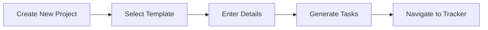

# AV Project Management Tool v6.1 - Enterprise Edition

[](https://github.com/yourusername/av-project-management)
[](LICENSE)
[](https://developer.mozilla.org/en-US/docs/Web/HTML)
[](https://developer.mozilla.org/en-US/docs/Web/CSS)
[](https://developer.mozilla.org/en-US/docs/Web/JavaScript)

## 📋 Overview

The **AV Project Management Tool** is a comprehensive, integrated web-based application designed to manage multiple audio-visual installation projects from executive oversight through detailed task execution. Built as a single-page application (SPA), it combines high-level portfolio management with granular project tracking, providing enterprise-grade capabilities with a modern, intuitive interface.

## 🎯 Purpose

This tool was specifically designed for organizations managing multiple AV installations across corporate environments, featuring dual interfaces for executives and project managers. It seamlessly integrates executive reporting dashboards with detailed project workflows, supporting enterprise processes including:

- 📝 **SNOW (ServiceNow)** ticket management
- 👥 **RACI** matrices
- 🤝 **Stakeholder** coordination
- 🔧 **Technical** implementation phases

## ✨ Key Features

### 🏢 **Executive Dashboard (Landing Page)**

#### Portfolio Overview
- 📊 Visual grid of all active projects with real-time status
- 🎨 Customizable view options
- 📈 Trend analysis capabilities

#### Animated Project Cards
```
✅ Health status indicators with pulse animations (green/yellow/red)
✅ Phase progress visualization with colored milestone dots
✅ Circular progress rings with gradient fills
✅ Live countdown timers showing days remaining/overdue
```

#### Executive Analytics
| Metric | Description |
|--------|-------------|
| **Total Projects** | Count of all projects in the system |
| **Avg Completion** | Average completion rate across projects |
| **At Risk** | Number of projects with red health status |
| **Active Projects** | Currently in-progress projects |
| **Due This Week** | Projects with deadlines within 7 days |
| **Team Utilization** | Resource allocation percentage |

#### Advanced Filtering System
- 🔍 **Search** by project name
- 🏷️ **Filter by type**: `New Build` • `Upgrade` • `Break Fix`
- 📊 **Filter by status**: `Active` • `At Risk` • `On Track` • `Completed`
- 📍 **Filter by phase**: `Phase 1-5`

---

### 📊 **Individual Project Trackers**

#### Real-Time Analytics Dashboard
```javascript
// Visual progress indicators for entire projects
- Overall Progress: 0-100%
- Phase 1: Logistics
- Phase 2: AV Setup
- Phase 3: Installation
- Phase 4: Testing
- Phase 5: Closeout
```

#### Comprehensive Task Management

<details>
<summary><b>Task Features</b></summary>

- ✏️ **Template-based** task generation
- 📁 **5-Phase** project structure
- 🔗 **Hierarchical** task organization
- 🎯 **Priority levels**:
  - `🔴 Critical`
  - `🟠 High`
  - `🟡 Medium`
  - `⚪ Low`
- 📊 **Status tracking**:
  - `⏹️ Not Started`
  - `▶️ In Progress`
  - `✅ Completed`
- 💚 **Health indicators** with dropdown selection

</details>

---

### 🚀 **Multi-Project Management**

#### Dynamic Project Creation



#### Project Templates

| Template | Tasks | Use Case |
|----------|-------|----------|
| **🏗️ New AV Build** | 14+ | Complete installation from scratch |
| **⬆️ Upgrade** | 8+ | System upgrade projects |
| **🔧 Break Fix** | 6+ | Repair and troubleshooting |
| **📄 Blank** | 0 | Custom project setup |

#### Seamless Navigation
- 🔗 URL-based routing for direct project access
- 🔄 Global navigation bar
- ⬅️ Browser back/forward support
- 👁️ Quick view without leaving dashboard

---

### 🔧 **Advanced Functionality**

<table>
<tr>
<td width="50%">

#### Data Management
- 💾 **Auto-Save**: LocalStorage persistence
- 📊 **Bulk Export**: CSV generation
- 🔄 **Project Cloning**: Template creation
- 📈 **Real-time Updates**: Live progress

</td>
<td width="50%">

#### Quick Actions
- 👁️ **View**: Open full tracker
- ⚡ **Quick View**: Summary popup
- 📋 **Clone**: Duplicate as template
- 📥 **Export**: Download CSV

</td>
</tr>
</table>

---

### 🎨 **Modern UI/UX**

#### Visual Design System

```css
/* Color Palette */
--primary-500: #0ea5e9;  /* Main brand color */
--success-500: #22c55e;  /* Success states */
--warning-500: #f59e0b;  /* Warning states */
--danger-500: #ef4444;   /* Error states */
```

#### Interactive Elements
- **🌊 Animated Backgrounds**: Dynamic gradient animations
- **🔮 Glassmorphism**: Backdrop filters and transparency
- **📱 Responsive Layout**: Desktop and tablet optimized
- **🎭 Professional Theme**: Dark navigation with light content
- **✨ Micro-interactions**: Hover effects and smooth transitions

---

## 🏗️ Project Structure

### Phase Breakdown

<details>
<summary><b>📋 Phase 1: Pre-Installation – Logistics</b></summary>

- ✅ Create Project Folder in Egnyte
- ✅ Create SNOW Ticket for Project
- ✅ Initial Project Information Gathered
- ✅ RACI Gathered to Determine Stakeholders
- ✅ Kick-off Meeting
- ✅ Request Vendor Quote
- ✅ Submit Finalized Quote for Approval
- ✅ Create SNOW Request for PO
- ✅ Verify PO Receipt by Vendor

</details>

<details>
<summary><b>🔧 Phase 2: Pre-Installation - AV Setup</b></summary>

- ✅ Request Hardware MAC and Serial Numbers
- ✅ Verify Installation Dates with Stakeholders
- ✅ Verify Space Name with Stakeholders
- ✅ Schedule Installation Window

</details>

<details>
<summary><b>🏗️ Phase 3: Installation and Commissioning</b></summary>

- ✅ AV Vendor Delivery and Installation
- ✅ System Configuration
- ✅ Initial Testing and Verification

</details>

<details>
<summary><b>🧪 Phase 4: Post-Installation Testing</b></summary>

- ✅ Comprehensive System Testing
- ✅ User Acceptance Testing
- ✅ Performance Optimization

</details>

<details>
<summary><b>📝 Phase 5: Project Closeout</b></summary>

- ✅ Documentation Handover
- ✅ Training Delivery
- ✅ Asset Management Updates
- ✅ Project Review and Closure

</details>

---

## 💻 Technical Architecture

### **Frontend Technologies**

```yaml
HTML5:
  - Semantic markup
  - Modern web standards
  - Accessibility features

CSS3:
  - Custom properties (variables)
  - Flexbox & Grid layouts
  - Animations & transitions
  - Glassmorphism effects

JavaScript:
  - Vanilla JS (no dependencies)
  - ES6+ features
  - Event-driven architecture
  - LocalStorage API
```

### **Design Patterns**

| Pattern | Implementation |
|---------|---------------|
| **SPA Architecture** | Single-page app with dynamic content |
| **Component-Based** | Modular JavaScript functions |
| **Event-Driven** | Responsive UI interactions |
| **URL Routing** | Direct project access via parameters |

### **Data Management**

```javascript
// Project Storage Structure
{
  "project_id": {
    "id": "proj_1234567890",
    "name": "Conference Room AV Upgrade",
    "manager": "John Smith",
    "location": "Building A - Floor 3",
    "targetDate": "2024-12-31",
    "template": "upgrade",
    "status": "active",
    "health": "green",
    "tasks": [...]
  }
}
```

### **Browser Compatibility**

| Browser | Minimum Version |
|---------|----------------|
| Chrome | 90+ |
| Firefox | 88+ |
| Safari | 14+ |
| Edge | 90+ |

---

## 🚀 Getting Started

### **Installation**

```bash
# No installation required!
1. Download av-project-management.html
2. Open in any modern web browser
3. Start managing projects immediately
```

### **Creating Your First Project**

1. **Launch Dashboard**
   ```
   Open av-project-management.html in browser
   ```

2. **Create New Project**
   ```
   Click "➕ Create New Project" button
   ```

3. **Select Template**
   ```
   Choose from: New Build | Upgrade | Break Fix | Blank
   ```

4. **Enter Details**
   ```
   - Project Name: [Required]
   - Project Manager: [Required]
   - Site/Location: [Optional]
   - Target Date: [Required]
   ```

5. **Generate Project**
   ```
   Click "Create Project" → Auto-navigates to tracker
   ```

### **Managing Projects**

#### Dashboard Operations
- **View All Projects**: Default landing page view
- **Search Projects**: Use search bar for name filtering
- **Filter Projects**: Apply type/status/phase filters
- **Quick Actions**: Access from project card buttons

#### Tracker Operations
- **Update Tasks**: Click any field to edit
- **Change Status**: Use dropdown selectors
- **Track Progress**: View real-time analytics
- **Export Data**: Download CSV for reporting

---

## 🔧 Usage Scenarios

### **👔 For Executives**
```
Dashboard → View Metrics → Identify Issues → Export Reports
```
- Monitor portfolio-wide KPIs
- Identify at-risk projects instantly
- Track resource utilization
- Generate stakeholder reports

### **📋 For Project Managers**
```
Create Project → Manage Tasks → Update Status → Track Progress
```
- Initialize projects from templates
- Assign and track tasks
- Monitor phase completion
- Communicate project health

### **👥 For Teams**
```
Access Project → View Tasks → Update Status → Add Notes
```
- View assigned responsibilities
- Update task completion
- Document blockers
- Collaborate on deliverables

---

## 📱 Responsive Design

### Breakpoints

| Device | Resolution | Features |
|--------|------------|----------|
| **Desktop** | 1200px+ | Full features, multi-column |
| **Tablet** | 768px-1199px | Touch-optimized, condensed |
| **Mobile** | <768px | *Planned for v1.1* |

---

## 🔒 Data Management

### **Privacy & Security**

```javascript
// All data stored locally
localStorage.setItem('avProjects', JSON.stringify(projects));

// No external transmission
✅ Data stays on device
✅ No cloud storage
✅ No tracking/analytics
✅ GDPR compliant
```

### **Export Options**

| Format | Scope | Use Case |
|--------|-------|----------|
| **CSV** | Single Project | Detailed task report |
| **CSV** | All Projects | Portfolio overview |
| **Clone** | Single Project | Template creation |

### **Backup Strategy**

1. **Auto-Save**: Every change persisted
2. **Manual Export**: Regular CSV backups
3. **Browser Storage**: Survives restarts
4. **Data Recovery**: From exported files

---

## ⚡ Performance Features

### **Optimizations**

```javascript
// Key Performance Metrics
- First Paint: < 1s
- Interactive: < 2s
- DOM Updates: Minimal reflows
- Memory: < 50MB typical usage
```

### **Technical Optimizations**
- ⚡ Single-page architecture
- 🎯 Efficient DOM manipulation
- 💾 Lazy data loading
- 🎨 CSS transform animations
- 🔄 Debounced save operations

---

## 🎯 Key Benefits

<table>
<tr>
<td width="33%">

### **Centralized Management**
- 📊 Single dashboard
- 🔄 Consistent workflows
- 📈 Standardized reporting

</td>
<td width="33%">

### **Visual Reporting**
- 👁️ At-a-glance health
- 📊 Progress visualization
- ⏱️ Real-time updates

</td>
<td width="33%">

### **Template Efficiency**
- ⚡ Quick setup
- 📋 Consistent structure
- 🔄 Reusable templates

</td>
</tr>
</table>

---

## 🔮 Roadmap & Future Enhancements

### **Version 5.5.2** *(Aug 2025)*
- [ ] Database backend integration
- [ ] User authentication & roles
- [ ] Team collaboration features
- [ ] File attachment support
- [ ] Mobile responsive design

### **Version 5.5.3** *(Nov 2025)*
- [ ] Email notifications
- [ ] Gantt chart visualization
- [ ] Resource allocation tracking
- [ ] Budget management module
- [ ] Advanced reporting dashboard

### **Version 5.5.4** *(Dec 2025)*
- [ ] Dark mode theme
- [ ] API integrations (SNOW, Teams)
- [ ] Custom workflow builder
- [ ] AI-powered insights
- [ ] Multi-language support

---

## 🛠️ Development

### **Application Structure**

```
av-project-management.html
│
├── 🎨 Styles (Embedded CSS)
│   ├── Global Variables
│   ├── Navigation Styles
│   ├── Dashboard Components
│   ├── Tracker Components
│   └── Responsive Breakpoints
│
├── 📝 HTML Structure
│   ├── Navigation Bar
│   ├── Landing Page Container
│   ├── Tracker Page Container
│   └── Modal Components
│
└── ⚙️ Scripts (Embedded JavaScript)
    ├── Core Functions
    ├── Project Management
    ├── Task Operations
    ├── UI Updates
    └── Data Persistence
```

### **Key Functions**

| Function | Purpose | Parameters |
|----------|---------|------------|
| `createProject()` | Generate new project | template, metadata |
| `loadProject(id)` | Open project tracker | projectId |
| `renderProjects()` | Update dashboard | - |
| `updateAllProgress()` | Calculate metrics | - |
| `exportToExcel(project)` | Generate CSV | project object |
| `saveProjects()` | Persist to storage | - |

### **Event System**

```javascript
// Event Listeners
document.addEventListener('DOMContentLoaded', initializeApp);
document.addEventListener('click', handleGlobalClicks);
document.addEventListener('change', handleInputChanges);
document.addEventListener('keydown', handleKeyboardShortcuts);
```

---

## 📞 Support & Troubleshooting

### **Common Issues**

<details>
<summary><b>🔧 Projects Not Saving</b></summary>

**Solution:**
```javascript
// Check LocalStorage availability
if (typeof(Storage) !== "undefined") {
  // LocalStorage is supported
  localStorage.setItem('test', 'test');
} else {
  // No web storage support
  alert('Please enable LocalStorage in your browser');
}
```

</details>

<details>
<summary><b>🔧 Navigation Issues</b></summary>

**Solution:**
1. Clear browser cache: `Ctrl+F5`
2. Check URL parameters
3. Reload application
4. Verify project ID exists

</details>

<details>
<summary><b>🔧 Export Problems</b></summary>

**Solution:**
- Check browser download settings
- Verify popup blocker
- Try different browser
- Check disk space

</details>

### **Best Practices**

✅ **DO:**
- Regular exports for backup
- Use templates for consistency
- Update status daily
- Review dashboard weekly

❌ **DON'T:**
- Clear browser data without backup
- Use outdated browsers
- Ignore health indicators
- Skip phase requirements

---

## 📄 License

```
MIT License

Copyright (c) 2025 ShortWaveEcho

Permission is hereby granted, free of charge, to any person obtaining a copy
of this software and associated documentation files (the "Software"), to deal
in the Software without restriction, including without limitation the rights
to use, copy, modify, merge, publish, distribute, sublicense, and/or sell
copies of the Software, and to permit persons to whom the Software is
furnished to do so, subject to the following conditions:

The above copyright notice and this permission notice shall be included in all
copies or substantial portions of the Software.

THE SOFTWARE IS PROVIDED "AS IS", WITHOUT WARRANTY OF ANY KIND, EXPRESS OR
IMPLIED, INCLUDING BUT NOT LIMITED TO THE WARRANTIES OF MERCHANTABILITY,
FITNESS FOR A PARTICULAR PURPOSE AND NONINFRINGEMENT.
```

---

## 🎉 Conclusion

The **AV Project Management Tool** provides a comprehensive, enterprise-ready solution for managing multiple complex AV installation projects. With its dual-interface design serving both executives and project managers, intuitive visual reporting, and robust project tracking capabilities, it streamlines portfolio management while ensuring detailed task execution.

Whether you're an executive monitoring a portfolio of installations or a project manager handling day-to-day tasks, this tool provides the visibility, control, and efficiency needed to deliver successful AV projects on time and within scope.

---

## 📊 Quick Stats

| Metric | Value |
|--------|-------|
| **Version** | 5.5.1 |
| **Release Date** | 2025 |
| **Platform** | Browser |
| **Dependencies** | Browser |
| **File Size** | ~250KB |
| **License** | MIT |
| **Language** | English |

---

## 🤝 Contributing

We welcome contributions! Please see our [Contributing Guidelines](CONTRIBUTING.md) for details.

1. Fork the repository
2. Create your feature branch (`git checkout -b feature/AmazingFeature`)
3. Commit your changes (`git commit -m 'Add some AmazingFeature'`)
4. Push to the branch (`git push origin feature/AmazingFeature`)
5. Open a Pull Request

<div align="center">

**Built with ❤️ by the AV Project Management Team**

[⬆ Back to Top](#av-project-management-tool-v10---enterprise-edition)

</div>
